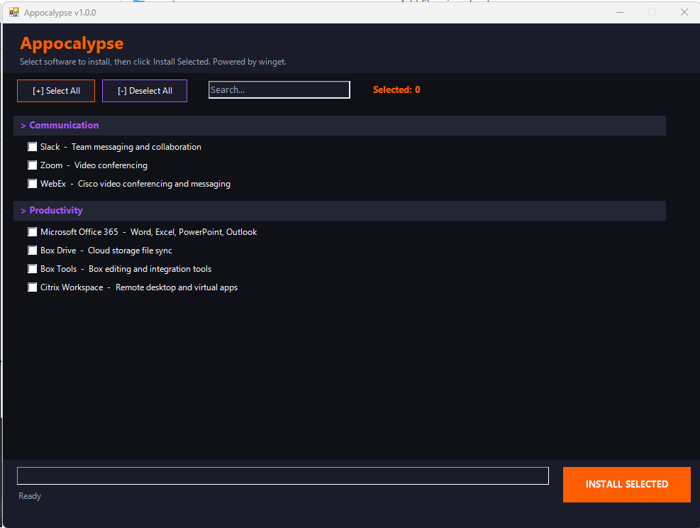

# ⚡ OneClickInstall

[](https://github.com/PowerShell/PowerShell)
[](https://www.microsoft.com/windows)
[](LICENSE)
[](https://github.com/microsoft/winget-cli)

A PowerShell-based bulk software installer with a modern GUI interface. Select the software you need, click install, and let it handle the rest — powered by **winget** (Windows Package Manager).



---

## ✨ Features

- 🖥️ **Modern Dark GUI** — Clean Windows Forms interface with categorized software lists
- 📦 **60+ Pre-configured Packages** — Browsers, dev tools, media, utilities, and more
- 🔍 **Search & Filter** — Quickly find packages across all categories
- ☑️ **Bulk Selection** — Select all, deselect all, or pick by category
- 📋 **Install Logging** — Full timestamped logs for every session
- ⚙️ **Customizable** — Edit a single JSON file to add/remove packages
- 🔇 **Silent Install** — All packages install silently in the background
- 🛡️ **Safe** — Uses official winget package manager, no third-party downloaders

---

## 📋 Requirements

|
 Requirement 
|
 Details 
|
|
-------------
|
---------
|
|
**
OS
**
|
 Windows 10 (1809+) / Windows 11 
|
|
**
PowerShell
**
|
 5.1 or later 
|
|
**
Winget
**
|
 v1.4+ (
[
Install Guide
](
https://learn.microsoft.com/en-us/windows/package-manager/winget/#install-winget
)
) 
|
|
**
Privileges
**
|
 Administrator (for silent installs) 
|

> **Note:** The script will attempt to install winget automatically if it's not detected.

---

## 🚀 Quick Start

### Option 1: Run directly (recommended)

```powershell
irm https://raw.githubusercontent.com/cmendez1-dev/Stanford-ization/OneClickInstall/main/OneClickInstall.ps1 | iex
