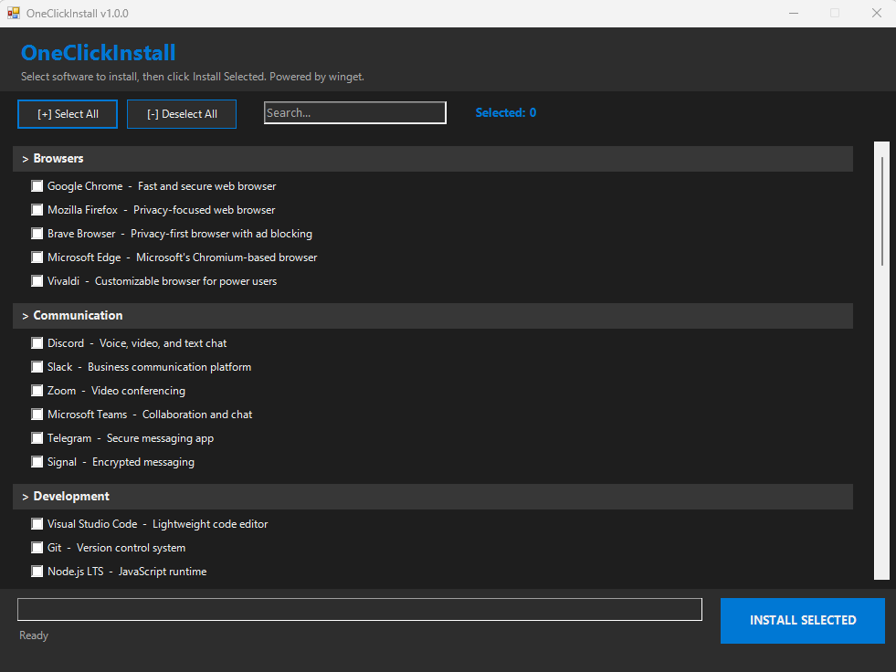

# OneClickInstall

[](https://github.com/PowerShell/PowerShell)
[](https://www.microsoft.com/windows)
[](LICENSE)
[](https://github.com/microsoft/winget-cli)

A PowerShell bulk software installer with a modern dark GUI. Select what you need, click install, done. Powered by **winget**.



---

## Quick Start

Open **PowerShell as Administrator** and run:

```powershell
irm https://raw.githubusercontent.com/cmendez1-dev/Stanford-ization/main/launch.ps1 | iex
